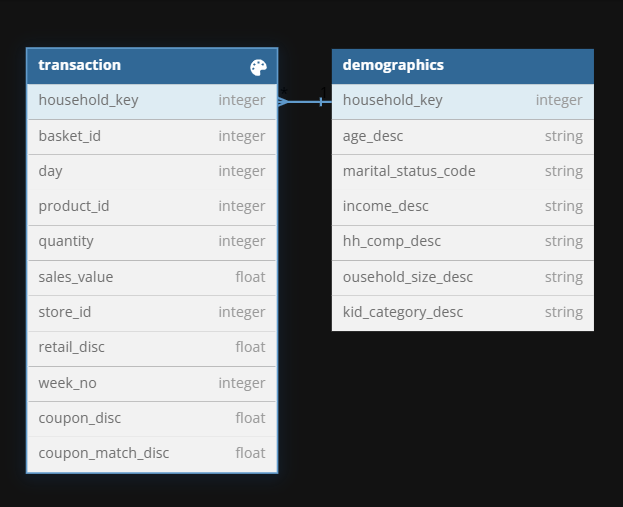

# Hypermarket Grocery Custoemr-Sales Analysis 

## Objectives

- Understand customer purchasing patterns, average spending, and response to discounts. 
- Identify loyal customers, high spenders, and discount-sensitive segments.

## Analysis Tasks

- Segmenting Households by Spending
- Order Frequency
- Average Order Value 
- RFM Analysis
- Top Households by Spending
- Spending by Age Group
- Spending by Income group
- Spending by Homeownership
- Discount Utilization 
- Customer Segmentation by Total Spend, Total Orders and Total Discount.

Business insights and recommendations are provided after each analysis to utilize the findings and make informed decisions.
